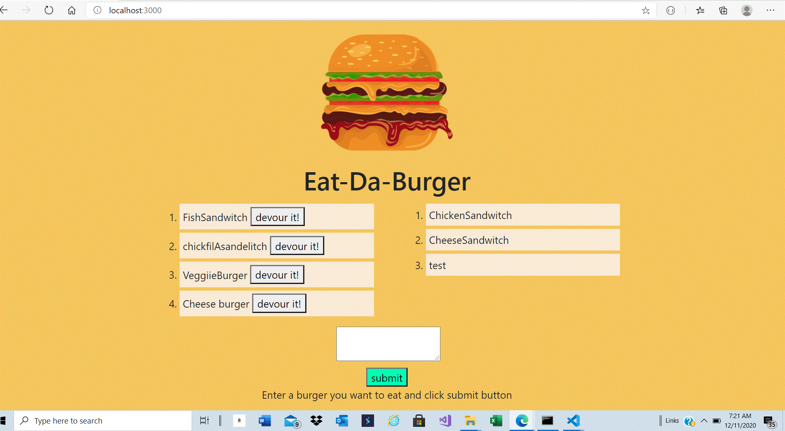
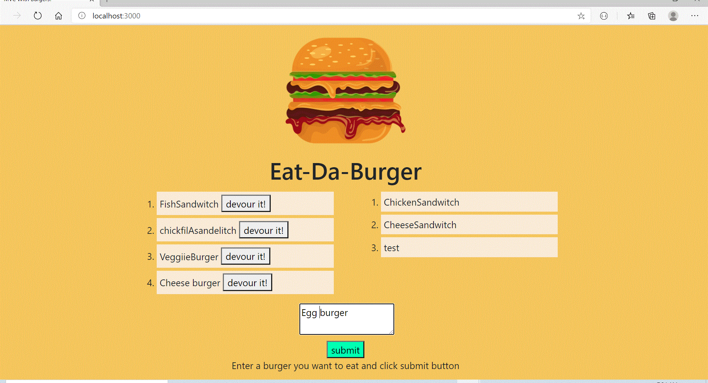
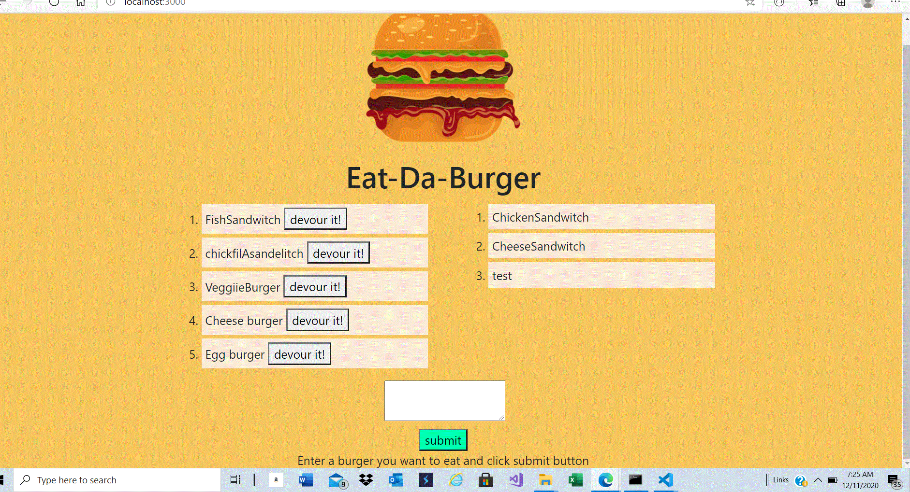

# burger-12.8.20

## About The Project

---

-    Eat-Da-Burger! is a restaurant app that lets users input the names of burgers they'd like to eat.

-    Whenever a user submits a burger's name, app will display the burger on the left side of the page -- waiting to be devoured.

-    Each burger in the waiting area also has a `Devour it!` button. When the user clicks it, the burger will move to the right side of the page.

-    This app will store every burger in a database, whether devoured or not.

## Implemented the following functionalities

-    selectAll()
     -    Retrieve all burgers from database by executing SELECT staement and display on the UI.
-    insertOne()
     -    Add the burger to burgers table in database when user enter the burger name and click on submit button by executing INSERT statement
-    updateOne()
     -    Update the burger's devoured state from false to true and display in UI by executing UPDATE statement
-    index.handlebars
     -    To display to devour burgers and non-devour burgers on UI
     -    Form to submit new burger.

## Built With

-    express
-    express-handlebars
-    mysql
-    dotenv
-    Boot Strap Grid System
-    CSS
-    MVC(ORM)

## Getting Started

To get a local copy up and running follow below steps.

## Prerequisites

None

## Installation instructions:

Clone the repo git clone git@github.com:NirmalaAbothu/burger-12.8.20.git then open Git Bash window ,navigate to project folder then run
following commands

-    Make a package.json file by running `npm init` from the command line.

-    Install the Express npm package: `npm install express`.

-    Install the Handlebars npm package: `npm install express-handlebars`.

-    Install MySQL npm package: `npm install mysql`.
-    Install dotenv package: `npm install dotenv`
-    Navigate to project folder in VS Code,then
-    create ".env" file in root directory and assign your mysql password to PW, for example
-    PW = your mysql password.
-    Again navigat to terminal your project folder.
-    Make sure you're in the `db` folder of your app.
-    Start MySQL command line tool and login: `mysql -u root -p`.
-    Enter your password and click
-    Run the command `source schema.sql`
     -    This will run schema file and all of the queries in it to create database.
-    Run the command `source seeds.sql`
     -    This will insert the entries defined in `seeds.sql.
-    Run `exit` to close out of the MySQL command line tool.
-    Navigate to your app folder and run the following command to start the server
     -    `node server.js` ,then navigate to browser and enter "localhost:3001" to see app
          in browser.

## Credits

Followed the documentation about MySql,Handlebars and MVC

## License & copyright

Copyright © 2020 Nirmala Abothu

[Deployed Heroku Link](https://murmuring-depths-53897.herokuapp.com/)
